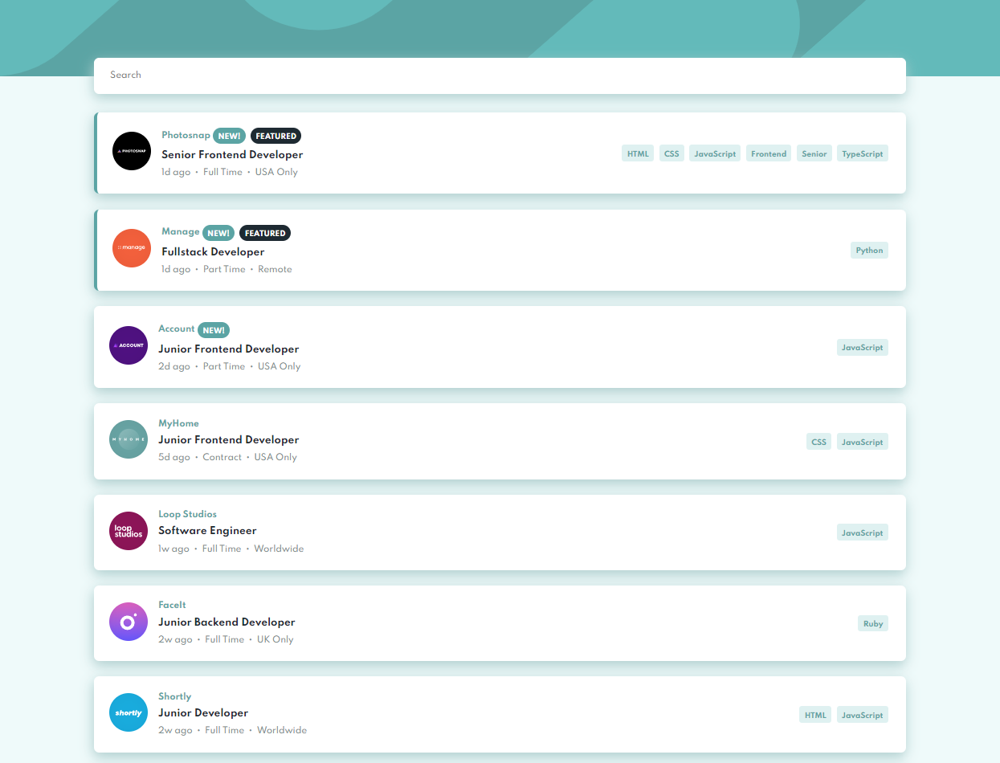

# Frontend Mentor - Job listings with filtering solution

This is a solution to the [Job listings with filtering challenge on Frontend Mentor](https://www.frontendmentor.io/challenges/job-listings-with-filtering-ivstIPCt). Frontend Mentor challenges help you improve your coding skills by building realistic projects. 

## Table of contents

- [Overview](#overview)
  - [The challenge](#the-challenge)
  - [Screenshot](#screenshot)
  - [Links](#links)
  - [Built with](#built-with)
- [Author](#author)

## Overview

### The challenge

Users should be able to:

- View the optimal layout for the site depending on their device's screen size
- See hover states for all interactive elements on the page
- Filter job listings based on the categories

### Screenshot

### Links

- Solution URL [here](https://www.frontendmentor.io/solutions/responsive-design-using-radix-and-stitches-rJ6d82V75).
- Live Site URL [here](https://job-listings-chi.vercel.app/).

### Built with
 
- Mobile-first workflow
- [TypeScript](https://www.typescriptlang.org/) TypeScript is a strongly typed programming language that builds on JavaScript.
- [React](https://reactjs.org/) - JavaScript library for building UI
- [Next.js](https://nextjs.org/) - React framework with hybrid static & server rendering support
- [Radix-ui](https://www.radix-ui.com/) - Accessible components for building high‑quality design systems and web apps in React
- [Stitches](https://stitches.dev/) - CSS-in-JS with near-zero runtime, multi-variant support.

## Author

- Frontend Mentor - [@eduardogerentklein](https://www.frontendmentor.io/profile/eduardogerentklein)